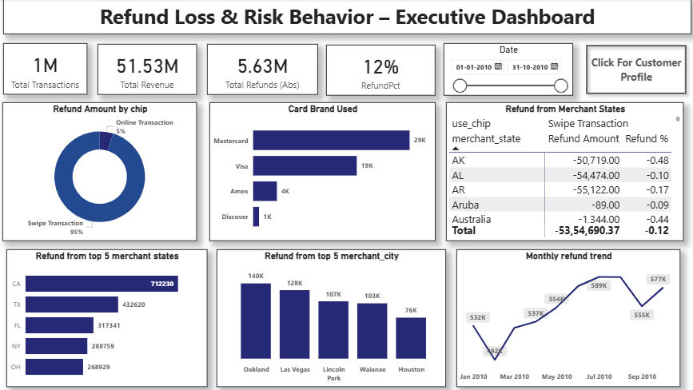

# 🛡️ Refund Loss & Risk Behavior – Executive Dashboard

## 📌 Objective

This executive dashboard is designed to support fraud analysts and risk management teams in identifying **refund abuse patterns**, analyzing **customer risk behavior**, and minimizing **revenue leakage**.

The solution combines **transactional, customer, and card-level data** into a unified model, visualized in Power BI through a **2-page dashboard**:

1. **Executive Dashboard** – High-level overview of refund trends, KPIs, and risk concentration  
2. **Customer Profile** – Deep dive into customer segments by income, credit score, and geography  

---

## 📂 Dataset

- **Source:** [Financial Transactions Dataset – Kaggle](https://www.kaggle.com/datasets/computingvictor/transactions-fraud-datasets)
- **Period Covered:** Jan 2010 – Oct 2010
- **Volume:** 1 million+ transaction records, user profiles, and card details

---

## 🔧 Data Pipeline

- 🐍 **Python (Pandas, NumPy):** Data cleaning, null handling, type formatting, and feature correction
- 🛢️ **MySQL:** SQL joins and transformation across multiple tables to build a unified `master_transaction` dataset
- 📊 **Power BI:** Data modeling, DAX measures, calculated columns, slicers, and final visualization

---

## 📊 Dashboard Structure

### **Page 1 – Executive Dashboard**
- **KPIs:** Total Transactions, Total Refunds, Refund %, Refund Amount  
- **Refund Breakdown:** By chip type (swipe vs online), card brand, merchant state, top cities  
- **Refund Trends:** Monthly trend analysis, top 5 refund states & cities  
- **Geographic Exposure:** Refund % variation across merchant states  

### **Page 2 – Customer Profile**
- **KPIs:** Total Customers, Credit Score <650, Max Credit Limit, Max No. of Cards Issued  
- **Refund Behavior:** By income band, credit score, age group  
- **Customer Distribution:** Merchant state mapping with geographic concentration  

---

## 📈 Key Insights

- 💳 **Swipe transactions** (95% share) carry significantly higher refund risk compared to online transactions.  
- 🔄 **Visa & Mastercard** dominate refund-linked card usage, accounting for the majority of cases.  
- 🌍 Refund activity is heavily concentrated in **California, Florida, and New York**, making them priority states for monitoring.  
- 🧑‍💼 Customers earning **₹25K–50K** show the highest refund % (~61%), indicating **higher abuse risk in lower income bands**.  
- 📉 Customers with **credit scores <700** have above-average refund rates, linking **financial risk with transactional behavior**.  
- 📊 Refund volume shows a **steady increase from Jan–May 2010**, pointing to **policy exploitation or repeated abuse**.  

---

## 🛠️ Tools Used

| Tool | Purpose |
|------|---------|
| **Python (Pandas, NumPy)** | Data preprocessing and cleaning |
| **MySQL** | Data transformation, joins, and unification |
| **Power BI** | DAX measures, visualizations, slicers, KPIs |

---

---

## 📷 Dashboard Snapshots

### Executive Dashboard  
  

### Customer Profile  
  

---

## 📥 Download the Power BI File

You can download the `.pbix` file for this dashboard here:  
🔗 [Fraud & Refund Risk Intelligence Dashboard – Power BI File (Google Drive)](https://drive.google.com/file/d/1ty9EXEIUBFhbo-BmJOfH4UaSHHj-xsUZ/view?usp=sharing)

---

## 🧠 Business Use Case

This dashboard enables financial institutions to:  
- Detect **refund abuse & fraud-prone patterns**  
- Identify **high-risk customer groups** by income and credit score  
- Focus monitoring on **geographies with maximum exposure**  
- Support **data-driven fraud investigation and policy design**  

---

## 🙋‍♂️ About Me

**Kanishka Narayan Choudhury**  
Aspiring Data Analyst | SQL | Excel | Power BI | Python  
🔗 [LinkedIn Profile](https://www.linkedin.com/in/kanishka-n-choudhury/)

---

